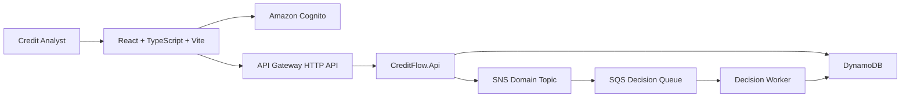

# Architecture

## Overview

CreditFlow Ops is a serverless credit decision workflow built with .NET, React, DynamoDB, SNS, SQS, Cognito, and AWS Lambda.

This document will describe the system architecture, service boundaries, request flow, event flow, data storage, security, observability, and trade-offs.

## Diagrams

### Architecture

## Main Components

TODO.

## Request Flow

TODO.

## Event-Driven Flow

TODO.

## Data Storage

TODO.

## Authentication and Authorization

TODO.

## Observability

TODO.

## Security

TODO.

## Trade-offs

TODO.
